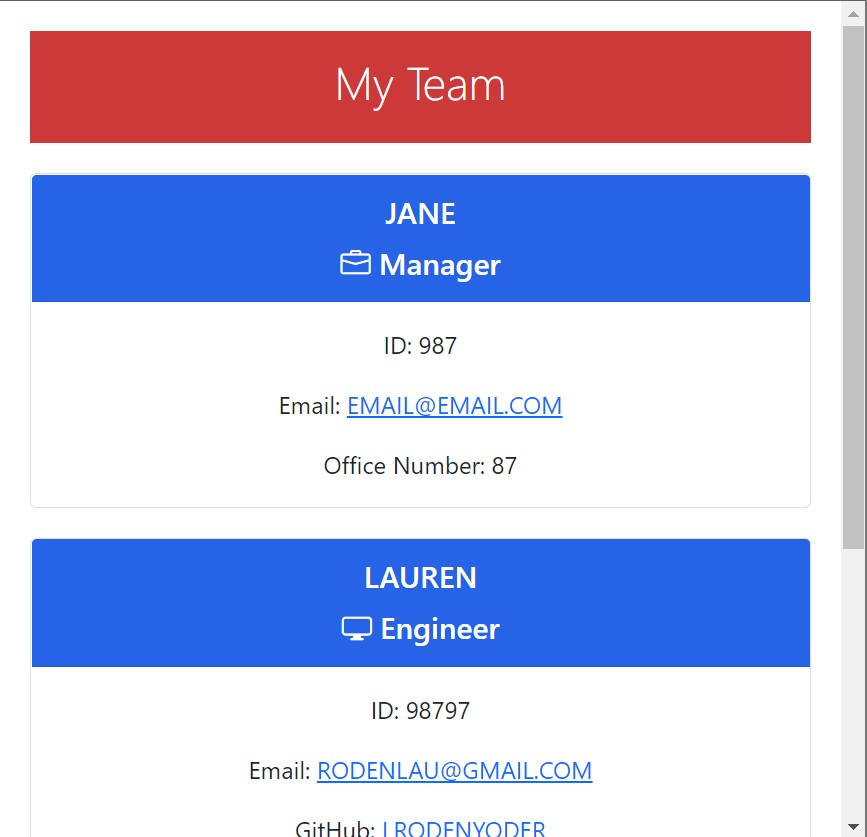

# Team Profile Generator
  
  
  
  
  
  
  
  

  ## Description

  ----------------------

  This project uses Node.js in order to generate a formatted HTML file based on user input. Using this generator allows for a team manager to quickly create a webpage with their team's information. Jest was used to facilitate test driven and object oriented development.

  [Click Here](https://drive.google.com/file/d/1LDCIdH4t_hezZp_Nhln1go7semvwRjId/view) for a video walkthrough on how to use this generator.

  ## Installation

  ----------------------------------------------------

  To install the Team Profile generator or view the code, open `terminal` or `gitbash` and navigate to desktop.

    cd desktop

Clone this repo

     git clone git@github.com:lrodenyoder/Team-Profile-Generator
  
Open folder in Visual Studio Code

Before the generator can be used, a `dist` folder must be created in the root directory of the project (where the generated HTML file will be written)...

    cd Team-Profile-Generator
    mkdir dist

...and npm modules for the project need to be installed

    npm install

To initialize the generator, run the following command

    node index.js

## Sample Finished File
----------------------------

 ## License

  -----------------------

  MIT License 

  Copyright (c) [2022] by [Lauren Yoder]

  [Click Here](https://choosealicense.com/licenses/mit/) to go to license details